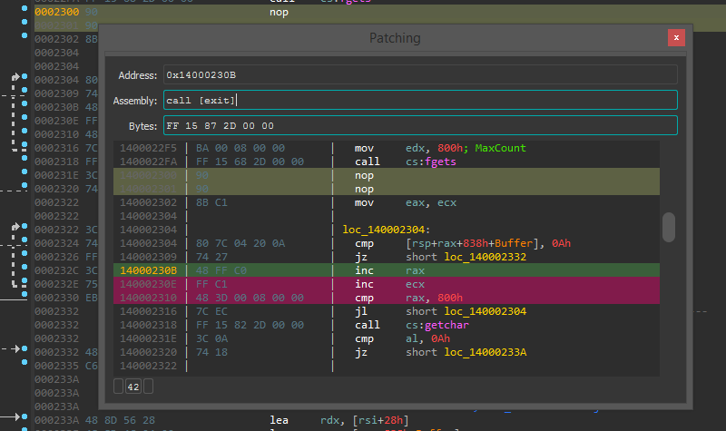
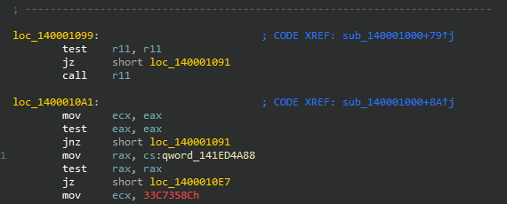
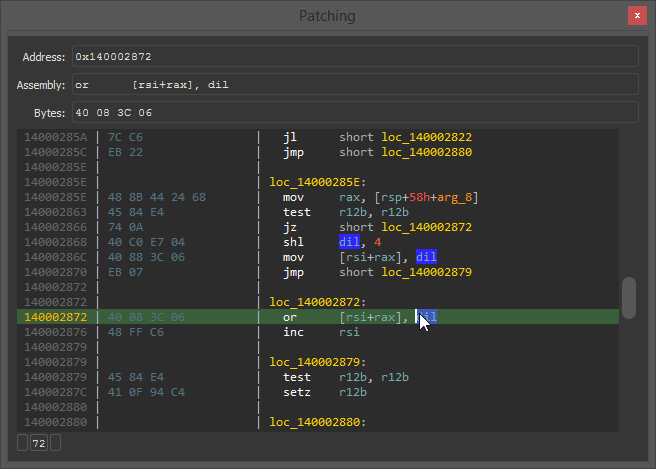
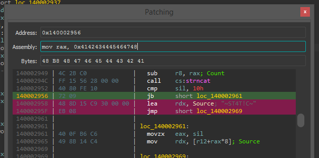
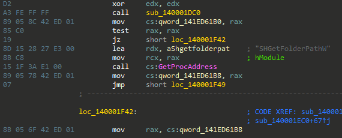
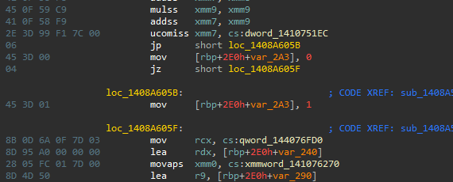
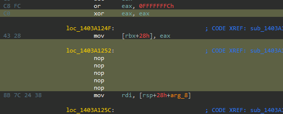

# Patching - Interactive Binary Patching for IDA Pro

<p align="center"></p>

## Overview

Patching assembly code to change the behavior of an existing program is not uncommon in malware analysis, software reverse engineering, and broader domains of security research. This project extends the popular [IDA Pro](https://www.hex-rays.com/products/ida/) disassembler to create a more robust interactive binary patching workflow designed for rapid iteration.

This project is currently powered by a minor [fork](https://github.com/gaasedelen/keystone) of the ubiquitous [Keystone Engine](https://github.com/keystone-engine/keystone), supporting x86/x64 and Arm/Arm64 patching with plans to enable the remaining Keystone architectures in a future release.

Special thanks to [Hex-Rays](https://hex-rays.com/) for supporting the development of this plugin.

## Releases

* v0.1 -- Initial release

# Installation

This plugin requires IDA 7.6 and Python 3. It supports Windows, Linux, and macOS.

## Easy Install

Run the following line in the IDA console to automatically install the plugin:

### Windows / Linux

```python
import urllib.request as r; exec(r.urlopen('https://github.com/gaasedelen/patching/raw/main/install.py').read())
```

### macOS

```python
import urllib.request as r; exec(r.urlopen('https://github.com/gaasedelen/patching/raw/main/install.py', cafile='/etc/ssl/cert.pem').read())
```

## Manual Install

Alternatively, the plugin can be manually installed by downloading the distributable plugin package for your respective platform from the [releases](https://github.com/gaasedelen/patching/releases) page and unzipping it to your plugins folder.

It is __*strongly*__ recommended you install this plugin into IDA's user plugin directory:

```python
import ida_diskio, os; print(os.path.join(ida_diskio.get_user_idadir(), "plugins"))
```

# Usage

The patching plugin will automatically load for supported architectures (x86/x64/Arm/Arm64) and inject relevant patching actions into the right click context menu of the IDA disassembly views:

<p align="center"></p>

A complete listing of the contextual patching actions are described in the following sections.

## Assemble

The main patching dialog can be launched via the Assemble action in the right click context menu. It simulates a basic IDA disassembly view that can be used to edit one or several instructions in rapid succession.

<p align="center"></p>

The assembly line is an editable field that can be used to modify instructions in real-time. Pressing enter will commit (patch) the entered instruction into the database.

Your current location (a.k.a your cursor) will always be highlighted in green. Instructions that will be clobbered as a result of your patch / edit will be highlighted in red prior to committing the patch.

<p align="center"></p>

Finally, the `UP` and `DOWN` arrow keys can be used while still focused on the editable assembly text field to quickly move the cursor up and down the disassembly view without using the mouse.

## NOP

The most common patching action is to NOP out one or more instructions. For this reason, the NOP action will always be visible in the right click menu for quick access.

<p align="center"></p>

Individual instructions can be NOP'ed, as well as a selected range of instructions.

## Force Conditional Jump

Forcing a conditional jump to always execute a 'good' path is another common patching action. The plugin will only show this action when right clicking a conditional jump instruction.

<p align="center"></p>

If you *never* want a conditional jump to be taken, you can just NOP it instead!

## Save & Quick Apply

Patches can be saved (applied) to a selected executable via the patching submenu at any time. The quick-apply action makes it even faster to save subsequent patches using the same settings. 

<p align="center"></p>

The plugin will also make an active effort to retain a backup (`.bak`) of the original executable which it uses to 'cleanly' apply the current set of database patches during each save. 

## Revert Patch

Finally, if you are ever unhappy with a patch you can simply right click patched (yellow) blocks of instructions to revert them to their original value.

<p align="center"></p>

While it is 'easy' to revert bytes back to their original value, it can be 'hard' to restore analysis to its previous state. Reverting a patch may *occasionally* require additional human fixups. 

# Known Bugs

* Further improve ARM / ARM64 / THUMB correctness
* Define 'better' behavior for cpp::like::symbols(...) / IDBs (very sketchy right now)
* Adding / Updating / Modifying / Showing / Warning about Relocation Entries??
* Handle renamed registers (like against dwarf annotated idb)?
* A number of new instructions (circa 2017 and later) are not supported by Keystone
* A few problematic instruction encodings by Keystone

# Future Work

Time and motivation permitting, future work may include:

* Enable the remaining major architectures supported by Keystone:
  * PPC32 / PPC64 / MIPS32 / MIPS64 / SPARC / SystemZ
* Multi instruction assembly (eg. `xor eax, eax; ret;`)
* Multi line assembly (eg. shellcode / asm labels)
* Interactive byte / data / string editing
* Symbol hinting / auto-complete / fuzzy-matching
* Syntax highlighting the editable assembly line
* Better hinting of errors, syntax issues, etc
* NOP / Force Jump from Hex-Rays view (sounds easy, but probably pretty hard!)
* radio button toggle between 'pretty print' mode vs 'raw' mode? or display both?
  ```
  Pretty:  mov     [rsp+48h+dwCreationDisposition], 3
     Raw:  mov     [rsp+20h], 3
  ```

I welcome external contributions, issues, and feature requests. Please make any pull requests to the `develop` branch of this repository if you would like them to be considered for a future release.

# Authors

* Markus Gaasedelen ([@gaasedelen](https://twitter.com/gaasedelen))
